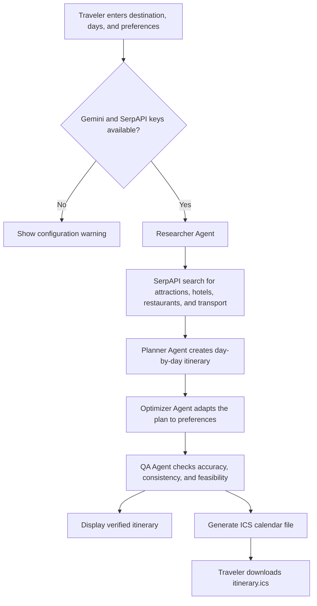

# Agentic Travel Planner

Agentic Travel Planner is a Streamlit application that uses multiple collaborative AI agents to research a destination and generate a practical day-by-day itinerary.

## Features

- Researches attractions, accommodations, restaurants, and transport information with SerpAPI.
- Uses Google Gemini to coordinate four specialized agents:
  - **Researcher** gathers current travel information.
  - **Planner** creates a day-by-day itinerary.
  - **Optimizer** adapts the plan to the traveler's preferences.
  - **QA** reviews the final itinerary for consistency and feasibility.
- Exports the verified itinerary as an `.ics` calendar file.
- Supports trips from 1 to 30 days.

## Requirements

- Python 3.9 or newer
- A Google Gemini API key
- A SerpAPI key

## Setup

1. Create and activate a virtual environment:

   ```powershell
   python -m venv .venv
   .\.venv\Scripts\Activate.ps1
   ```

2. Install the project dependencies:

   ```powershell
   pip install -e .
   ```

3. Create a `.env` file in the project root:

   ```dotenv
   GEMINI_API_KEY=your_gemini_api_key
   SERP_API_KEY=your_serpapi_key
   ```

   Keep `.env` private and do not commit it to source control.

## Run the App

Start Streamlit from the project directory:

```powershell
streamlit run agentic_travel_planner.py
```

Then open the local URL displayed by Streamlit, usually `http://localhost:8501`.

## Usage

1. Enter a destination.
2. Select the number of travel days.
3. Optionally describe preferences, such as museums, food tours, or limited nightlife.
4. Select **Generate Itinerary**.
5. Review the verified itinerary and download it with **Download Itinerary (.ics)**.

## Project Structure

```text
.
├── agentic_travel_planner.py  # Streamlit application and agent workflow
├── pyproject.toml              # Project metadata and dependencies
├── uv.lock                     # Locked dependency versions
└── README.md                   # Project documentation
```

The repository also contains local environment and build metadata such as `.env`, `.venv/`, `__pycache__/`, and `agentic_travel_planner.egg-info/`; these are not required source files and should not be committed.

## How It Works

The application sends the destination to the Researcher agent first. Its findings are passed to the Planner, then refined by the Optimizer according to the user's preferences. The QA agent performs a final review, and the resulting `Day N` sections are converted into calendar events for the downloadable ICS file.



## Notes

- The app stops until both API keys are available.
- Travel information depends on the quality and availability of live SerpAPI results.
- The generated itinerary should be checked against official provider, venue, and transportation information before booking.